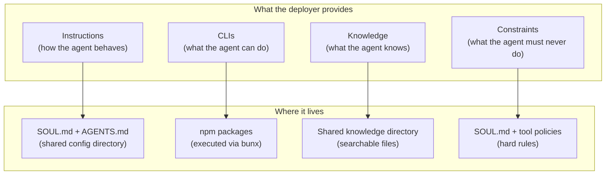
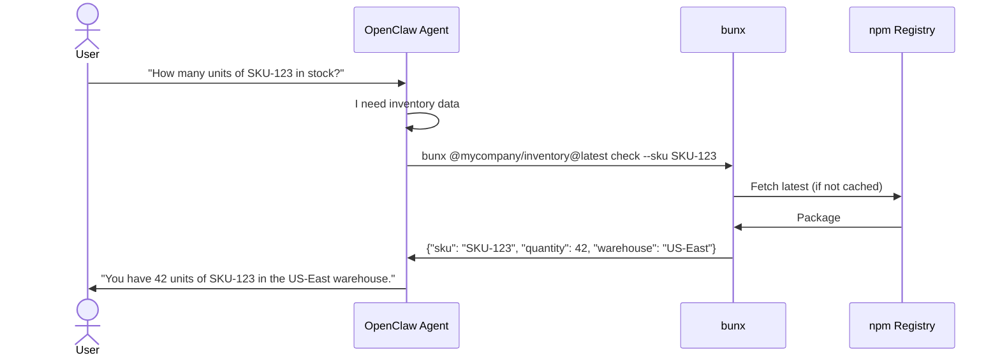

# Agent-Native Paradigm: Rethinking the Backend

## Core Principle

This is not an adapter for existing backends. This is an **opinionated, agent-native architecture** that deployers adopt fully. No REST APIs, no databases, no microservices. Everything is rebuilt around the assumption that an intelligent agent is the executor.

> **Clarification:** The “no REST APIs” principle applies to the deployer’s backend — business logic is expressed as CLIs, not REST endpoints. The framework’s control plane uses REST/WebSocket internally for auth, routing, and admin.

## The Mental Model Shift

**Traditional SaaS:**

```
User → Frontend → API Server → Database → Backend Services → External APIs
```

**Agent-Native SaaS:**

```
User → Frontend → Control Plane → OpenClaw Gateway → Agent uses tools autonomously
```

The agent IS the backend. It doesn’t call an API server — it IS the logic layer. It doesn’t query a database — its workspace IS the data. It doesn’t orchestrate services — it runs CLIs.

## Four Primitives

Everything the deployer provides fits into four categories:



| Primitive        | Purpose                                               | Example                                                                |
| ---------------- | ----------------------------------------------------- | ---------------------------------------------------------------------- |
| **Instructions** | How the agent behaves, its workflows, its personality | “You are a financial analyst. Always include charts.”                  |
| **CLIs**         | Capabilities the agent can execute                    | `bunx @mycompany/billing@latest charge --customer X`                   |
| **Knowledge**    | Domain expertise, reference data, docs                | Product catalog, compliance rules, procedures                          |
| **Constraints**  | Hard rules that override everything                   | “Never delete production data. Never send money without confirmation.” |

## CLIs as the Backend

### Why CLIs

The deployer’s entire “backend” is a set of CLI tools published to npm. The agent runs them via [bun](https://bun.sh/)’s `bunx` command.

| Property                   | Why It Works                                                                                                                                                                                                                                                                          |
| -------------------------- | ------------------------------------------------------------------------------------------------------------------------------------------------------------------------------------------------------------------------------------------------------------------------------------- |
| **Self-documenting**       | `--help` tells the agent everything                                                                                                                                                                                                                                                   |
| **Language-agnostic**      | Build in any language, publish to npm                                                                                                                                                                                                                                                 |
| **Always up to date**      | `bunx @package@latest` — Bun resolves from the npm registry and caches locally. The `@latest` tag ensures the newest published version is fetched when the cache is stale. For time-critical updates, deployers can clear the Bun cache (`bun pm cache rm`) or use `--no-cache` flag. |
| **Composable**             | Agent chains tools naturally                                                                                                                                                                                                                                                          |
| **Testable independently** | Deployer tests CLI without needing OpenClaw                                                                                                                                                                                                                                           |
| **Zero infrastructure**    | No registry auth, no cron, no version management                                                                                                                                                                                                                                      |
| **Ecosystem leverage**     | Reuse any existing npm CLI tool (public or private)                                                                                                                                                                                                                                   |
| **Compilable**             | [bun compile](https://bun.com/docs/bundler/executables) can package TypeScript into standalone binaries                                                                                                                                                                               |

### How It Works



### Deployer Workflow

```
Write CLI in TypeScript → npm publish → done
```

That’s it. No deployment. No CI/CD to a server. No infrastructure. The agent uses the latest version on next invocation via `bunx`.

### CLI Convention

Deployers build CLIs following these conventions:

| Convention     | Requirement                                                    |
| -------------- | -------------------------------------------------------------- |
| **Output**     | JSON to stdout by default                                      |
| **Errors**     | Stderr with clear messages                                     |
| **Exit codes** | 0 = success, non-zero = error                                  |
| **Help**       | `--help` with structured description of all commands and flags |
| **Naming**     | Scoped npm packages: `@org/domain-cli`                         |
| **Auth**       | Accept credentials via environment variables or flags          |

### Example CLI Structure

```typescript
#!/usr/bin/env bun

// @mycompany/inventory — published to npm
import { Command } from 'commander'

const program = new Command()
  .name('inventory')
  .description('Inventory management tools')

program
  .command('check')
  .description('Check stock level for a SKU')
  .requiredOption('--sku <sku>', 'Product SKU')
  .action(async ({ sku }) => {
    const result = await db.query('SELECT * FROM inventory WHERE sku = ?', [
      sku
    ])
    console.log(JSON.stringify(result))
  })

program
  .command('restock')
  .description('Restock a product')
  .requiredOption('--sku <sku>', 'Product SKU')
  .requiredOption('--quantity <n>', 'Quantity to add', parseInt)
  .action(async ({ sku, quantity }) => {
    await db.query('UPDATE inventory SET qty = qty + ? WHERE sku = ?', [
      quantity,
      sku
    ])
    console.log(JSON.stringify({ success: true, sku, added: quantity }))
  })

program.parse()
```

### Public vs Private CLIs

```
# Public CLIs — anyone can use
bunx stripe-cli@latest charges list --limit 5
bunx @openai/cli@latest files upload --file report.pdf

# Deployer's private CLIs
bunx @mycompany/inventory@latest check --sku ABC
bunx @mycompany/billing@latest invoice --customer alice@co.com
```

For private npm packages, the host needs a `.npmrc` with an auth token. One-time setup.

## Knowledge as Files

### The Pluggable Knowledge Slot

The framework provides a directory where deployers place their domain knowledge. The agent searches it when needed.

```
/mnt/tigerfs/knowledge/
  product-catalog.md
  compliance-rules.md
  procedures/
    refund-process.md
    onboarding-checklist.md
  reference/
    pricing-tiers.json
    country-codes.csv
```

### How the Agent Uses It

OpenClaw’s built-in [memory search](https://docs.openclaw.ai/concepts/memory) provides hybrid vector + BM25 search. The shared knowledge directory is indexed alongside memory files. The agent searches it naturally — no special API, no custom code.

The deployer just drops files in the directory. The framework indexes them. The agent finds what it needs.

**Shared knowledge and per-agent isolation:** The `memory-timescaledb` plugin scopes queries by `agent_id`. Shared knowledge files are indexed under a special `__shared__` agent_id that all agents can query. The plugin uses **hybrid search** (pgvector similarity + pg_textsearch BM25) — combining semantic matching with exact keyword lookups. Both the agent’s own chunks AND the shared pool are searched: `WHERE agent_id IN ($1, ‘__shared__’)`. This preserves RLS isolation (agents can’t see each other’s memories) while allowing access to common knowledge.

### What Goes Where

| Content                         | Location                                | Who Writes It |
| ------------------------------- | --------------------------------------- | ------------- |
| How the agent behaves           | `SOUL.md` / `AGENTS.md` (shared config) | Deployer      |
| What the agent knows (shared)   | `/mnt/tigerfs/knowledge/`               | Deployer      |
| What the agent knows (per user) | `MEMORY.md` / `memory/` (workspace)     | Agent         |
| User profile and preferences    | `USER.md` (workspace)                   | Agent         |

## Instructions as Markdown

### Business Logic in Natural Language

Instead of encoding business logic in code, describe it in markdown:

**Traditional (code):**

```javascript
if (days_since_purchase <= 30 && item.condition === 'unused') {
  processRefund()
} else if (days_since_purchase <= 90) {
  offerStoreCredit()
} else {
  denyRefund()
}
```

**Agent-native (markdown):**

```markdown
## Refund Policy

- Full refund within 30 days if item is unused
- Store credit within 90 days
- Beyond 90 days, politely decline
- Use your judgment for edge cases (defective items, loyal customers)
```

The code version handles exactly the cases you coded. The markdown version handles everything, including edge cases.

### Why This Works

The agent can:

- Read and understand natural language instructions
- Apply judgment to ambiguous situations
- Adapt when the real world doesn’t match rigid rules
- Ask for clarification when truly uncertain

The deployer gets:

- Business logic that’s readable by anyone (not just developers)
- Changes that take effect immediately (update markdown, hot-reload)
- No compilation, no deployment, no testing of edge-case code paths

## Constraints as Hard Rules

Some things must NEVER be left to agent judgment:

```markdown
## Hard Constraints (SOUL.md)

- NEVER delete production data without explicit user confirmation
- NEVER process payments exceeding $10,000 without manager approval
- NEVER share one user's data with another user
- NEVER execute commands outside the approved CLI list
```

These go in `SOUL.md` — loaded into every session, every time. Combined with [tool policies](https://docs.openclaw.ai/gateway/sandbox-vs-tool-policy-vs-elevated) at the gateway level for enforcement beyond prompt-level rules.

## Comparison: Traditional vs Agent-Native

| Aspect               | Traditional SaaS                            | Agent-Native SaaS                       |
| -------------------- | ------------------------------------------- | --------------------------------------- |
| **Backend**          | API server with routes, controllers, models | CLIs executed via `bunx`                |
| **Database**         | PostgreSQL, Redis, migrations, ORM          | Workspace files (markdown, JSON, JSONL) |
| **Business logic**   | Code (if/else, state machines)              | Markdown instructions                   |
| **Domain knowledge** | Knowledge base service, Elasticsearch       | Files in a directory, auto-indexed      |
| **Configuration**    | Feature flags, admin panels, env vars       | Markdown files, hot-reloaded            |
| **API design**       | REST/GraphQL schema, versioning, docs       | CLI `--help` output                     |
| **Deployment**       | Build → deploy → rollout                    | `npm publish` → done                    |
| **Updates**          | CI/CD pipeline, blue-green, canary          | `bunx cli@latest` — always current      |
| **Testing**          | Unit tests, integration tests, e2e          | Test the CLI independently              |
| **Scaling**          | Horizontal scaling, load balancers          | Add hosts, add gateway processes        |
