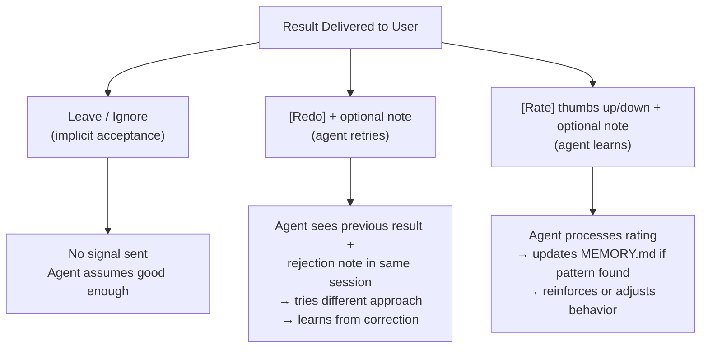
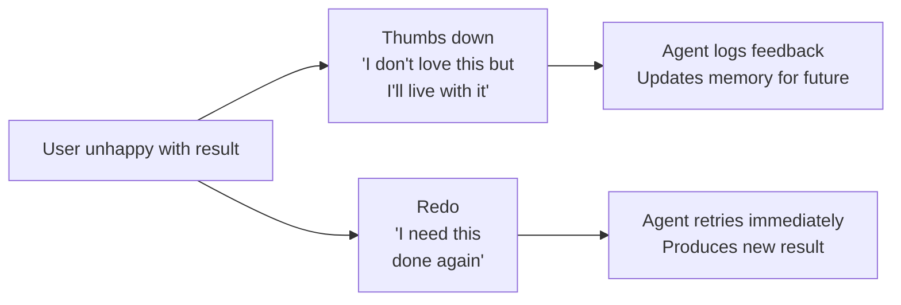
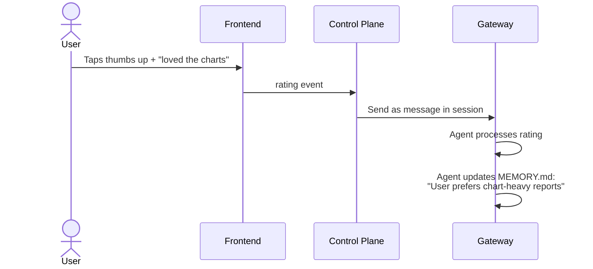
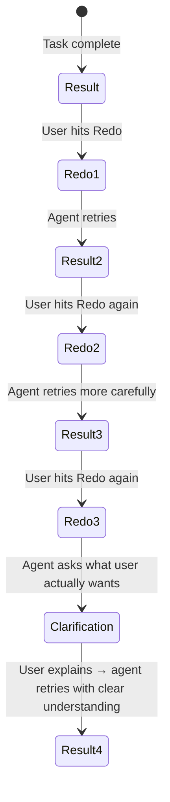

# Feedback: Ratings, Redo, and Agent Learning

## Core Principle

The conversation IS the feedback mechanism. The memory system IS the learning mechanism. Minimal UI, maximum signal.

## UX When a Result Arrives

## The Three Actions

### 1. Leave (Implicit Acceptance)

User sees the result and moves on. No action needed. Strongest positive signal is when the user actually uses the output.

### 2. Redo + Optional Note

User needs the task done again differently.

| Redo Input                          | What Agent Receives                                    |
| ----------------------------------- | ------------------------------------------------------ |
| Redo (no note)                      | “User rejected the output. Try a different approach.”  |
| Redo + “too formal”                 | “User rejected: too formal. Make it more casual.”      |
| Redo + “keep charts, redo the text” | “User rejected partially: keep charts, redo the text.” |
| Redo + “wrong data, use Q3”         | “User rejected: wrong data source. Use Q3 data.”       |

**Redo is an action** — the agent must produce a new result.

### 3. Rate (thumbs up/down) + Optional Note

User wants to leave feedback without requesting new work.

| Rating Input                         | What Agent Receives                              |
| ------------------------------------ | ------------------------------------------------ |
| Thumbs up (no note)                  | “User rated positively.”                         |
| Thumbs up + “loved the chart format” | “User rated positively: loved the chart format.” |
| Thumbs down (no note)                | “User rated negatively.”                         |
| Thumbs down + “too verbose”          | “User rated negatively: too verbose.”            |

**Rating is feedback** — the agent learns but doesn’t produce new output.

## Distinction: Thumbs Down vs Redo

- **Thumbs down** = passive feedback, agent learns for next time
- **Redo** = active request, agent acts now

## How Ratings Reach the Agent

Every rating is sent directly to the agent as a message. No batching, no deferred processing, no feedback files.

**Why not batch or defer?** The token cost of processing a rating (~500 tokens) is negligible compared to the task that produced the result (50,000+ tokens). It’s a rounding error. Keep it simple — just send it.

**Security gate bypass for ratings:** Rating messages generated by the control plane bypass Layers 3-4. However, if the rating includes a user-typed note, the note text MUST pass through Layers 1-2 (sanitization + heuristic guards) before being forwarded to the agent. Layers 3-4 (LLM classification) can be skipped for rating notes since they are short, low-risk text appended to a trusted message template.

**Why positive ratings matter:** If the agent knows “user loved the chart format,” it reinforces that behavior. Without the signal, the agent might change approach for no reason. OpenClaw’s [memory](https://docs.openclaw.ai/concepts/memory) system is designed for this — writing durable facts like “user prefers chart-heavy reports (rated positively 3 times).”

## Multiple Redos

After 2-3 redos on the same task, the problem is understanding, not execution. The agent should switch to clarification:

This is handled via `AGENTS.md` instructions, not a system feature:

> “After 2 failed redo attempts, stop retrying and ask the user to describe specifically what they want. Use the `request_clarification` tool to pause and wait for the user’s response.”

The agent tracks redo count within the session context. Each redo is a message in the same session, so the agent sees the full history: original request → result → redo 1 → result → redo 2 → result → switches to clarification. No external counter needed — the conversation IS the counter.

## Long-Term Learning from Feedback

The agent is instructed (via `AGENTS.md`) to look for patterns across feedback:

| Pattern                                     | Agent Action                                                  |
| ------------------------------------------- | ------------------------------------------------------------- |
| User rates thumbs down “too formal” 3 times | Update `USER.md`: “Prefers casual tone”                       |
| User rates thumbs up on chart-heavy reports | Update `MEMORY.md`: “Charts are valued”                       |
| User always redoes executive summaries      | Update `MEMORY.md`: “Summaries need extra care for this user” |
| User never uses Redo                        | No action — agent is performing well                          |

No analytics system needed. The agent learns through its own memory, informed by direct feedback.

## What the Agent Notices (Summary)

| Event                 | Source                                                         | How Agent Learns                                                            |
| --------------------- | -------------------------------------------------------------- | --------------------------------------------------------------------------- |
| Task request          | User via frontend                                              | Normal session message                                                      |
| Redo + note           | User via frontend                                              | Session message → retry + learn                                             |
| Rating + note         | User via frontend                                              | Session message → update memory                                             |
| File upload           | User via frontend                                              | File appears in workspace                                                   |
| Profile changes       | User tells agent                                               | Conversation → updates USER.md                                              |
| Returns after absence | User opens app                                                 | Agent has memory/session history                                            |
| Scheduled task done   | OpenClaw [cron](https://docs.openclaw.ai/automation/cron-jobs) | Results in [session transcripts](https://docs.openclaw.ai/concepts/session) |
| Config updates        | Shared config directory                                        | Hot-reload, automatic                                                       |
| Tier/plan change      | Control plane                                                  | Config patch via gateway API                                                |
| Account deletion      | Control plane                                                  | Gateway process killed, agent not notified                                  |
