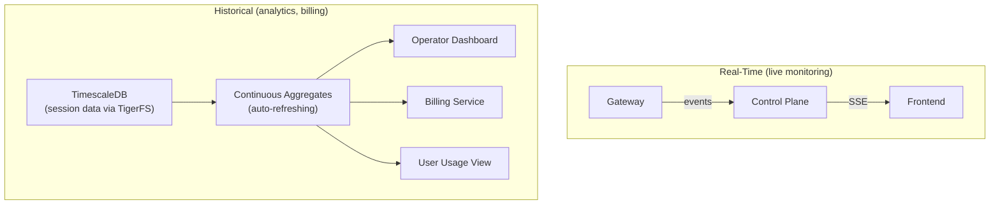

# Observability: Usage Tracking and Metering

## Core Principle

Leverage OpenClaw’s native [usage tracking](https://docs.openclaw.ai/concepts/usage-tracking). With [TigerFS](../architecture/data.md), session data lives in TimescaleDB — enabling continuous aggregates for cross-user analytics without polling. Real-time data streams via SSE.

## What OpenClaw Tracks Out of the Box (Per Gateway)

OpenClaw already provides comprehensive per-message and per-session usage data:

### Per Message

| Metric           | Detail                                           |
| ---------------- | ------------------------------------------------ |
| Input tokens     | Including cache read/write breakdown             |
| Output tokens    | Completion tokens                                |
| Cost (USD)       | Calculated from model pricing                    |
| Latency          | Duration in ms                                   |
| Model + Provider | Which model handled this message                 |
| Tool calls       | Which tools were invoked, count                  |
| Stop reason      | Why the agent stopped (end_turn, tool_use, etc.) |

### Per Session

| Metric          | Detail                              |
| --------------- | ----------------------------------- |
| Total tokens    | Aggregated across all messages      |
| Total cost      | USD                                 |
| Message counts  | User, assistant, tool calls         |
| Latency stats   | avg, p95, min, max                  |
| Daily breakdown | Tokens, cost, messages per day      |
| Model usage     | Breakdown by model/provider         |
| Tool usage      | Count per tool name                 |
| Timeseries      | Usage points over time for charting |

### Per Provider

| Metric      | Detail                  |
| ----------- | ----------------------- |
| Quota usage | Percentage of plan used |
| Reset time  | When quota resets       |
| Plan        | Current plan name       |

### Gateway API Methods Available

| Method                      | Returns                                                                |
| --------------------------- | ---------------------------------------------------------------------- |
| `usage.cost`                | Aggregated cost summary for date range (daily breakdown, totals)       |
| `usage.status`              | Provider quota snapshots                                               |
| `sessions.usage`            | Per-session usage with aggregates (by model, provider, agent, channel) |
| `sessions.usage.timeseries` | Usage over time for charting                                           |
| `sessions.usage.logs`       | Per-message usage detail (up to 200 entries)                           |

### In-Chat Commands

- `/usage off` — disable usage footer
- `/usage tokens` — show tokens per response
- `/usage full` — show tokens + cost per response
- `/usage cost` — show local cost summary

> **Note:** OpenClaw’s `usage.cost` gateway method reads from local session transcript files, not a database. For cross-gateway analytics, the control plane must build its own `usage_events` hypertable in TimescaleDB (see plan Phase 6.3).

## Architecture: Two Data Paths

### Real-Time Path

Live progress, token counts, task status → events from gateway → control plane → SSE to frontend. No storage, no polling.

### Historical Path

Session transcripts written to TigerFS → stored in TimescaleDB → [continuous aggregates](https://docs.timescale.com/use-timescale/latest/continuous-aggregates/) auto-compute cross-user analytics:

- Per-user: total tokens, cost, tasks completed, breakdown by day/model
- Operator: all users aggregated, per-model usage, cost distribution
- Billing: sum cost per user per billing period → Stripe

Continuous aggregates refresh in the background as data changes. Always up to date, never stale. No polling gateways.

### User-Facing View

- User asks “how much have I used?” → query continuous aggregate filtered by email
- Or user asks their agent directly → `/usage full` works natively in OpenClaw

### Billing Integration

Continuous aggregate computes per-user cost in USD → billing service reads it at billing time → charges via Stripe.

## Data Available Per User (Verbose)

The “most verbose” view a user or operator can get:

| Metric                     | Granularity | Source                               |
| -------------------------- | ----------- | ------------------------------------ |
| Token usage (in/out/cache) | Per message | `sessions.usage.logs`                |
| Cost (USD)                 | Per message | `sessions.usage.logs`                |
| Model used                 | Per message | `sessions.usage.logs`                |
| Tool calls                 | Per call    | `sessions.usage.logs`                |
| Latency                    | Per message | `sessions.usage.logs`                |
| Tasks completed            | Per session | `sessions.usage`                     |
| Daily totals               | Per day     | `usage.cost`                         |
| Monthly totals             | Per month   | Aggregated from `usage.cost`         |
| Provider quota             | Real-time   | `usage.status`                       |
| Storage used               | Per user    | Workspace directory metrics          |
| File uploads               | Per upload  | Control plane logs                   |
| Gate rejections            | Per attempt | Control plane logs                   |
| Compute time               | Per agent   | Agent runtime metrics (from gateway) |
