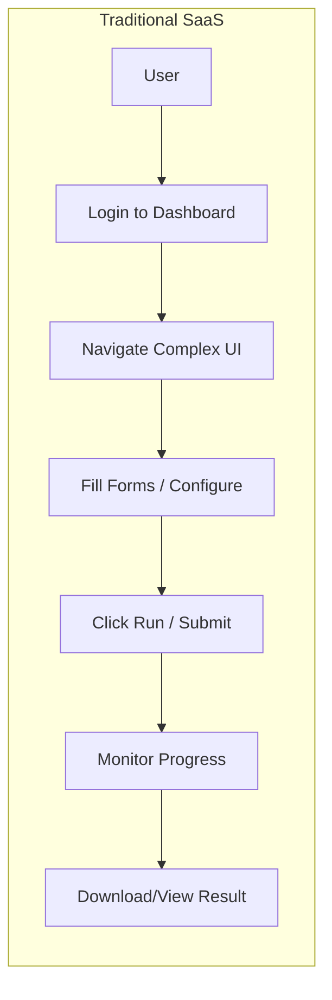
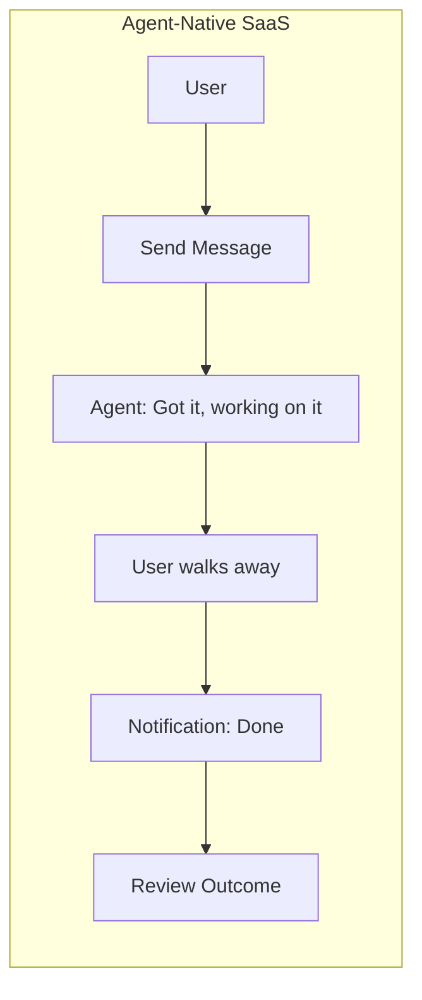

# Vision: Agent-Native SaaS

## The Core Insight

Traditional SaaS forces users to **operate machines** — click buttons, fill forms, navigate dashboards, configure settings. But for a category of SaaS where users only care about **outcomes**, all that UI is friction, not value.

## The Vision

A deployed product where **the product IS the agent**. No dashboards. No complex UIs. No learning curve.

Users don’t care about the process. They care about the output/outcome. They want to:

1. **Fire** — describe what they want
2. **Forget** — walk away
3. **Glance** — optionally peek at a readonly live feed of progress (like a security camera)
4. **Receive** — get notified when the task is done
5. **Review** — check the outcome, accept or request changes

## Traditional SaaS vs Agent-Native SaaS

## The Entire UX Surface

Four surfaces, all through the web app:

| Surface             | Purpose                            | Nature                                              |
| ------------------- | ---------------------------------- | --------------------------------------------------- |
| **Chat**            | Submit tasks, receive results      | Conversational interface                            |
| **Live Feed**       | Readonly logs/progress from agents | Security camera model — glanceable, not interactive |
| **Notifications**   | “Your task is done”                | Alerts when tasks complete                          |
| **Usage / History** | Token usage, cost, past tasks      | Queryable via agent or UI                           |

No settings page. No onboarding wizard. No navigation. No learning curve.

## Why This Works

The “security camera” live feed model is critical for **trust calibration**:

- First few times, users watch closely
- Once they see consistent delivery, they stop watching
- The feed exists so users can **choose** to trust, not be **forced** to trust
- Solves the “black box anxiety” of AI products ("Is it working? Did it understand? Is it stuck?")

## Product Differentiation

With minimal UI, differentiation is entirely in:

- What domains/tasks can the agent handle?
- How good is it at doing them autonomously?
- How does it handle edge cases and failures?
- How well does it **personalize** over time?
